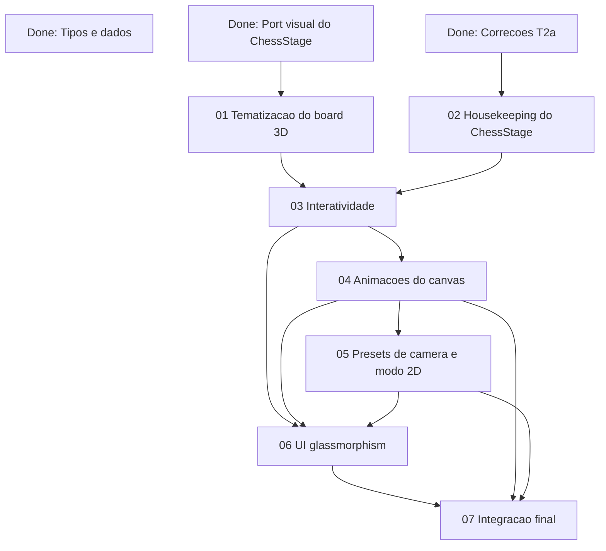

# Planos de execucao dos tickets remanescentes

Esta pasta organiza os planos de execucao dos tickets que ainda faltam no epic do `Pipo Chess 3d`.

## Fonte de verdade

Ler sempre nesta ordem:

1. `Docs/Specs/Epic_Brief_—_Pipo_Chess_3d.md`
2. `Docs/Specs/Core_Flows_—_Pipo_Chess_3d.md`
3. `Docs/Specs/Tech_Plan_—_Pipo_Chess_3d.md`
4. ticket alvo em `Docs/Tickets/`
5. plano de execucao correspondente nesta pasta

Os planos abaixo nao substituem os tickets nem os specs. Eles descrevem a sequencia de acoes recomendada para executar cada ticket de forma aderente ao estado atual do projeto e com o menor retrabalho possivel.

## Ordem recomendada

1. `01_Alinhar_tematizacao_board_3d.md`
2. `02_Housekeeping_ChessStage.md`
3. `03_Interatividade_ChessStage.md`
4. `04_Sistema_de_animacoes_canvas_3d.md`
5. `05_Presets_de_camera_e_modo_2d.md`
6. `06_UI_glassmorphism_mobile_first.md`
7. `07_Integracao_final_testes_e_limpeza.md`

## Dependencias entre planos

## Regra de uso

1. Nao iniciar um plano sem validar o gate de saida do plano anterior.
2. Em cada ticket, revisar novamente o ticket original e as secoes de spec citadas pelo plano.
3. Se a implementacao encontrada exigir mudar produto, parar e alinhar antes de seguir.
4. Se a implementacao divergir apenas do detalhe tecnico do Tech Plan, registrar a divergencia, revisar impacto nos tickets seguintes e so entao continuar.
5. Nenhum ticket deve ser dado como concluido sem validacao local proporcional ao risco: teste unitario, smoke test visual e checagem estatica quando aplicavel.

## Observacoes sobre o estado atual do codigo

- `src/scene/ChessStage.ts` ja concentra visual premium, highlights basicos e stubs para `setCameraPreset()` e `setAnimationMode()`.
- `src/components/ChessScene.tsx` ainda so faz `stage.update(...)` e nao orquestra camera nem modo de animacao.
- `src/state/gameStore.ts` ainda nao expoe estados transitrios de promocao e analise navegavel.
- `src/game/gameService.ts` ainda fixa `playerColor` em branco, entao a UI nova vai precisar de extensoes pontuais nesse contrato.
- `public/assets/models/pipo-chess-set.gltf` e `tools/generate-chess-assets.mjs` ainda existem no repositorio e devem ser tratados apenas no fechamento final.
