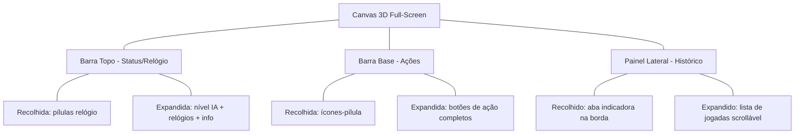
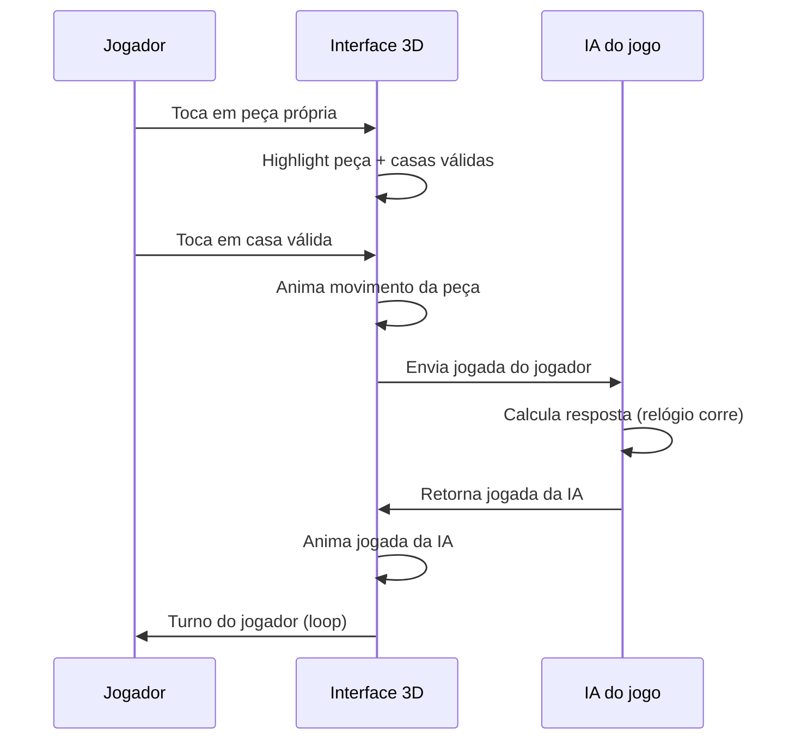
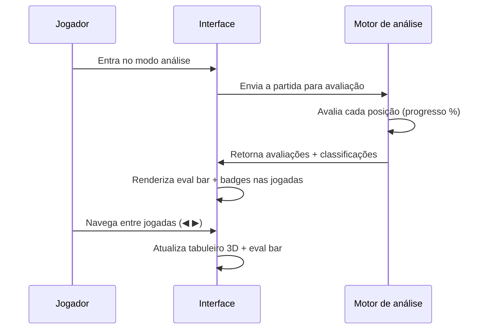

# Core Flows — Pipo Chess 3d

Referência: `spec:6c8fb743-ea96-401f-aa24-914f32fadeda/6e4679c4-e7d8-4cbe-9dd5-3fb83bfef724`

## Princípios de Layout

O canvas 3D ocupa 100% da tela. Toda a UI flutua sobre ele em **barras retráteis com glassmorphism** (fundo semi-transparente com blur). Quando recolhidas, apenas pequenos indicadores visuais (ícones/pílulas) ficam visíveis. Ao tocar, as barras expandem suavemente para dentro da tela.

O MVP parte de uma base visual 3D já existente para tabuleiro, peças e ambientação do canvas. Essa base estabelece o baseline visual oficial do canvas no MVP, ainda sujeita a ajustes de integração e refinamento ao longo do projeto.

| Zona | Conteúdo | Comportamento |
|------|----------|---------------|
| **Topo** | Status: nome da IA, nível, relógio de ambos os jogadores | Retrátil, mostra relógios quando recolhida |
| **Base** | Ações: Nova Partida, Desfazer, Refazer, Dica, Menu | Retrátil, mostra ícones-pílula quando recolhida |
| **Lateral direita** | Histórico de jogadas (notação algébrica) | Desliza da borda direita ao tocar no indicador |



### Wireframe — Layout Mobile (barras recolhidas)

```wireframe
<!DOCTYPE html>
<html>
<head>
<style>
  * { margin: 0; padding: 0; box-sizing: border-box; }
  body { font-family: -apple-system, sans-serif; background: #1a1a2e; color: #fff; height: 100vh; width: 100vw; position: relative; overflow: hidden; }
  .canvas-bg { position: absolute; inset: 0; background: linear-gradient(135deg, #1a1a2e 0%, #16213e 50%, #0f3460 100%); display: flex; align-items: center; justify-content: center; }
  .canvas-placeholder { width: 280px; height: 280px; border: 2px dashed rgba(255,255,255,0.2); border-radius: 8px; display: flex; align-items: center; justify-content: center; font-size: 14px; color: rgba(255,255,255,0.3); }
  .top-bar { position: absolute; top: 12px; left: 12px; right: 12px; display: flex; justify-content: space-between; align-items: center; }
  .clock-pill { background: rgba(255,255,255,0.12); backdrop-filter: blur(16px); border: 1px solid rgba(255,255,255,0.15); border-radius: 20px; padding: 6px 14px; font-size: 13px; font-weight: 600; display: flex; align-items: center; gap: 6px; }
  .clock-pill.active { background: rgba(100,200,255,0.2); border-color: rgba(100,200,255,0.4); }
  .dot { width: 6px; height: 6px; border-radius: 50%; background: rgba(255,255,255,0.4); }
  .dot.active { background: #64c8ff; }
  .bottom-bar { position: absolute; bottom: 16px; left: 50%; transform: translateX(-50%); display: flex; gap: 8px; }
  .action-pill { width: 44px; height: 44px; border-radius: 50%; background: rgba(255,255,255,0.12); backdrop-filter: blur(16px); border: 1px solid rgba(255,255,255,0.15); display: flex; align-items: center; justify-content: center; font-size: 18px; }
  .side-tab { position: absolute; right: 0; top: 50%; transform: translateY(-50%); width: 24px; height: 64px; background: rgba(255,255,255,0.12); backdrop-filter: blur(16px); border: 1px solid rgba(255,255,255,0.15); border-right: none; border-radius: 8px 0 0 8px; display: flex; align-items: center; justify-content: center; font-size: 10px; writing-mode: vertical-rl; }
</style>
</head>
<body>
  <div class="canvas-bg">
    <div class="canvas-placeholder">♟ Tabuleiro 3D ♟</div>
  </div>
  <div class="top-bar">
    <div class="clock-pill" data-element-id="clock-player">
      <span class="dot active"></span> 14:32
    </div>
    <div class="clock-pill active" data-element-id="clock-ai">
      ⚙ IA · GM <span class="dot active"></span> 12:08
    </div>
  </div>
  <div class="bottom-bar">
    <div class="action-pill" data-element-id="btn-new-game">➕</div>
    <div class="action-pill" data-element-id="btn-undo">↩</div>
    <div class="action-pill" data-element-id="btn-redo">↪</div>
    <div class="action-pill" data-element-id="btn-hint">💡</div>
    <div class="action-pill" data-element-id="btn-menu">☰</div>
  </div>
  <div class="side-tab" data-element-id="tab-history">▶ PGN</div>
</body>
</html>
```

### Wireframe — Layout Mobile (barras expandidas)

```wireframe
<!DOCTYPE html>
<html>
<head>
<style>
  * { margin: 0; padding: 0; box-sizing: border-box; }
  body { font-family: -apple-system, sans-serif; background: #1a1a2e; color: #fff; height: 100vh; width: 100vw; position: relative; overflow: hidden; }
  .canvas-bg { position: absolute; inset: 0; background: linear-gradient(135deg, #1a1a2e 0%, #16213e 50%, #0f3460 100%); display: flex; align-items: center; justify-content: center; }
  .canvas-placeholder { width: 220px; height: 220px; border: 2px dashed rgba(255,255,255,0.15); border-radius: 8px; display: flex; align-items: center; justify-content: center; font-size: 13px; color: rgba(255,255,255,0.2); }
  .top-bar-expanded { position: absolute; top: 0; left: 0; right: 0; background: rgba(255,255,255,0.08); backdrop-filter: blur(20px); border-bottom: 1px solid rgba(255,255,255,0.12); padding: 12px 16px; display: flex; justify-content: space-between; align-items: center; }
  .player-info { display: flex; flex-direction: column; gap: 2px; }
  .player-name { font-size: 11px; color: rgba(255,255,255,0.6); }
  .player-clock { font-size: 20px; font-weight: 700; font-variant-numeric: tabular-nums; }
  .player-clock.thinking { color: #64c8ff; }
  .level-badge { font-size: 10px; background: rgba(100,200,255,0.2); border-radius: 10px; padding: 2px 8px; color: #64c8ff; }
  .bottom-bar-expanded { position: absolute; bottom: 0; left: 0; right: 0; background: rgba(255,255,255,0.08); backdrop-filter: blur(20px); border-top: 1px solid rgba(255,255,255,0.12); padding: 12px 16px; display: flex; justify-content: space-around; align-items: center; }
  .action-btn { display: flex; flex-direction: column; align-items: center; gap: 4px; font-size: 10px; color: rgba(255,255,255,0.7); }
  .action-btn span { font-size: 22px; }
  .side-panel { position: absolute; right: 0; top: 0; bottom: 0; width: 180px; background: rgba(255,255,255,0.08); backdrop-filter: blur(20px); border-left: 1px solid rgba(255,255,255,0.12); padding: 56px 12px 80px; overflow-y: auto; }
  .panel-title { font-size: 11px; color: rgba(255,255,255,0.5); margin-bottom: 8px; text-transform: uppercase; letter-spacing: 1px; }
  .move-row { display: flex; gap: 8px; padding: 4px 0; font-size: 13px; font-family: monospace; }
  .move-num { color: rgba(255,255,255,0.35); width: 20px; }
  .move-white { color: rgba(255,255,255,0.9); }
  .move-black { color: rgba(255,255,255,0.55); }
</style>
</head>
<body>
  <div class="canvas-bg">
    <div class="canvas-placeholder">♟ Tabuleiro 3D ♟</div>
  </div>
  <div class="top-bar-expanded" data-element-id="top-bar">
    <div class="player-info">
      <span class="player-name">Você (Brancas)</span>
      <span class="player-clock">14:32</span>
    </div>
    <div class="player-info" style="text-align:right;">
      <span class="player-name">Stockfish <span class="level-badge">GM</span></span>
      <span class="player-clock thinking">12:08</span>
    </div>
  </div>
  <div class="bottom-bar-expanded" data-element-id="bottom-bar">
    <div class="action-btn" data-element-id="btn-new-game"><span>➕</span>Nova</div>
    <div class="action-btn" data-element-id="btn-undo"><span>↩</span>Desfazer</div>
    <div class="action-btn" data-element-id="btn-redo"><span>↪</span>Refazer</div>
    <div class="action-btn" data-element-id="btn-hint"><span>💡</span>Dica</div>
    <div class="action-btn" data-element-id="btn-camera"><span>🎥</span>Câmera</div>
    <div class="action-btn" data-element-id="btn-menu"><span>☰</span>Menu</div>
  </div>
  <div class="side-panel" data-element-id="history-panel">
    <div class="panel-title">Jogadas</div>
    <div class="move-row"><span class="move-num">1.</span><span class="move-white">e4</span><span class="move-black">e5</span></div>
    <div class="move-row"><span class="move-num">2.</span><span class="move-white">Nf3</span><span class="move-black">Nc6</span></div>
    <div class="move-row"><span class="move-num">3.</span><span class="move-white">Bb5</span><span class="move-black">a6</span></div>
    <div class="move-row"><span class="move-num">4.</span><span class="move-white">Ba4</span><span class="move-black">Nf6</span></div>
    <div class="move-row"><span class="move-num">5.</span><span class="move-white">O-O</span><span class="move-black">...</span></div>
  </div>
</body>
</html>
```

---

## Fluxo 1 — Iniciar Nova Partida

**Descrição:** O jogador configura e inicia uma nova partida contra a IA.

**Entrada:** Toque no botão "Nova Partida" (➕) na barra inferior.

**Passos:**
1. Um painel glassmorphism desliza de baixo para cima cobrindo ~60% da tela.
2. O jogador configura:
   - **Cor:** Brancas · Pretas · Aleatório (toggle de 3 estados)
   - **Nível da IA:** Slider horizontal com labels (Iniciante → Intermediário → Avançado → Mestre → Grande Mestre)
   - **Tempo:** Presets rápidos (Sem tempo · 5 min · 10 min · 15 min · 30 min) ou personalizado
3. Toca em "Jogar".
4. O painel recolhe. O tabuleiro reseta com peças na posição inicial. Os relógios inicializam com o tempo escolhido.
5. Se o jogador escolheu Pretas, a IA joga automaticamente a primeira jogada.

**Partida em andamento:** Se já existe uma partida ativa, um aviso pergunta se o jogador deseja substituí-la. Opções: "Continuar Partida Atual", "Iniciar Nova Partida" ou "Cancelar". Apenas uma partida pode permanecer no estado **em andamento** por vez.

### Wireframe — Painel de Nova Partida

```wireframe
<!DOCTYPE html>
<html>
<head>
<style>
  * { margin: 0; padding: 0; box-sizing: border-box; }
  body { font-family: -apple-system, sans-serif; background: #1a1a2e; color: #fff; height: 100vh; width: 100vw; position: relative; overflow: hidden; }
  .canvas-bg { position: absolute; inset: 0; background: linear-gradient(135deg, #1a1a2e 0%, #16213e 50%, #0f3460 100%); display: flex; align-items: center; justify-content: center; opacity: 0.4; }
  .canvas-placeholder { font-size: 14px; color: rgba(255,255,255,0.15); }
  .panel { position: absolute; bottom: 0; left: 0; right: 0; height: 62%; background: rgba(30,30,60,0.85); backdrop-filter: blur(24px); border-top: 1px solid rgba(255,255,255,0.12); border-radius: 20px 20px 0 0; padding: 20px 24px; display: flex; flex-direction: column; gap: 20px; }
  .handle { width: 40px; height: 4px; background: rgba(255,255,255,0.25); border-radius: 2px; margin: 0 auto 4px; }
  .panel-title { font-size: 18px; font-weight: 700; }
  .section-label { font-size: 11px; color: rgba(255,255,255,0.5); text-transform: uppercase; letter-spacing: 1px; margin-bottom: 6px; }
  .toggle-group { display: flex; gap: 8px; }
  .toggle-opt { flex: 1; text-align: center; padding: 10px 0; border-radius: 10px; font-size: 13px; font-weight: 600; background: rgba(255,255,255,0.06); border: 1px solid rgba(255,255,255,0.1); }
  .toggle-opt.active { background: rgba(100,200,255,0.2); border-color: #64c8ff; color: #64c8ff; }
  .slider-track { width: 100%; height: 6px; background: rgba(255,255,255,0.1); border-radius: 3px; position: relative; }
  .slider-fill { width: 70%; height: 100%; background: linear-gradient(90deg, #4ade80, #facc15, #f87171); border-radius: 3px; }
  .slider-labels { display: flex; justify-content: space-between; font-size: 9px; color: rgba(255,255,255,0.4); margin-top: 4px; }
  .slider-value { font-size: 13px; font-weight: 600; color: #facc15; text-align: center; margin-bottom: 4px; }
  .time-group { display: flex; gap: 6px; flex-wrap: wrap; }
  .time-opt { padding: 8px 14px; border-radius: 8px; font-size: 12px; background: rgba(255,255,255,0.06); border: 1px solid rgba(255,255,255,0.1); }
  .time-opt.active { background: rgba(100,200,255,0.2); border-color: #64c8ff; color: #64c8ff; }
  .play-btn { width: 100%; padding: 14px; border-radius: 12px; background: linear-gradient(135deg, #64c8ff, #3b82f6); border: none; color: #fff; font-size: 16px; font-weight: 700; text-align: center; margin-top: auto; }
</style>
</head>
<body>
  <div class="canvas-bg"><span class="canvas-placeholder">♟ Tabuleiro 3D (escurecido) ♟</span></div>
  <div class="panel" data-element-id="new-game-panel">
    <div class="handle"></div>
    <div class="panel-title">Nova Partida</div>
    <div>
      <div class="section-label">Sua Cor</div>
      <div class="toggle-group">
        <div class="toggle-opt active" data-element-id="color-white">♔ Brancas</div>
        <div class="toggle-opt" data-element-id="color-random">🎲 Aleatório</div>
        <div class="toggle-opt" data-element-id="color-black">♚ Pretas</div>
      </div>
    </div>
    <div>
      <div class="section-label">Nível da IA</div>
      <div class="slider-value">Avançado</div>
      <div class="slider-track"><div class="slider-fill"></div></div>
      <div class="slider-labels">
        <span>Iniciante</span><span>Inter.</span><span>Avançado</span><span>Mestre</span><span>GM</span>
      </div>
    </div>
    <div>
      <div class="section-label">Tempo por Jogador</div>
      <div class="time-group">
        <div class="time-opt" data-element-id="time-none">∞ Sem</div>
        <div class="time-opt" data-element-id="time-5">5 min</div>
        <div class="time-opt active" data-element-id="time-10">10 min</div>
        <div class="time-opt" data-element-id="time-15">15 min</div>
        <div class="time-opt" data-element-id="time-30">30 min</div>
      </div>
    </div>
    <div class="play-btn" data-element-id="btn-play">▶ Jogar</div>
  </div>
</body>
</html>
```

---

## Fluxo 2 — Gameplay (Jogar contra IA)

**Descrição:** Loop principal do jogo — o jogador faz sua jogada, a IA responde.

**Entrada:** Partida iniciada pelo Fluxo 1.

**Turno do jogador:**
1. O jogador pode tocar em uma peça própria para selecioná-la ou arrastá-la diretamente até a casa desejada.
2. Ao selecionar uma peça, ela recebe highlight (glow) e as casas válidas são marcadas com indicadores visuais (círculos semi-transparentes nas casas livres, anéis nas casas com peça inimiga).
3. Durante o arraste, a peça acompanha o gesto e a casa de destino válida continua indicada visualmente.
4. Ao tocar em uma casa válida ou soltar a peça em um destino válido, a peça se desloca com animação fluida até a casa final.
5. Se a jogada for inválida, a peça retorna suavemente à casa de origem.
6. Capturas usam feedback visual distinto para deixar claro que uma peça foi removida.
7. Roque, en passant e promoção possuem animações próprias.

**Promoção de peão:**
- Quando o peão chega à última fileira, um popup compacto aparece acima do peão com 4 ícones 2D das peças (Dama, Torre, Bispo, Cavalo).
- O jogador toca na peça desejada → o peão é substituído com animação própria de promoção.

**Turno da IA:**
1. O relógio da IA começa a correr.
2. Um indicador sutil mostra que a IA está pensando (pulso suave no ícone da IA na barra de topo).
3. Quando a jogada acontece, a origem e o destino recebem um destaque visual breve.
4. A peça da IA se move sozinha com animação fluida; em capturas, o feedback visual distinto também é exibido.
5. O relógio para.
6. Volta ao turno do jogador.

**Fim de partida:**
- Xeque-mate, afogamento, tempo esgotado, empate por repetição, regra dos 50 movimentos ou material insuficiente.
- Um modal glassmorphism entra com animação suave e destaque visual do resultado ("Vitória!", "Derrota" ou "Empate"), com opções: "Analisar Partida", "Nova Partida" ou "Menu".



---

## Fluxo 3 — Solicitar Dica

**Descrição:** O jogador pede uma sugestão de jogada durante seu turno.

**Entrada:** Toque no botão "Dica" (💡) na barra inferior. Disponível apenas durante o turno do jogador.

**Passos:**
1. O botão entra em estado de loading (animação de pulso).
2. A IA calcula a melhor jogada para a posição atual.
3. Em partidas com relógio, o tempo do jogador continua correndo durante o cálculo e durante a exibição da dica.
4. As casas de origem e destino da jogada sugerida começam a pulsar com highlight diferenciado (cor distinta dos highlights de seleção normal).
5. O highlight pulsante permanece por alguns segundos e desvanece, ou até o jogador interagir com o tabuleiro.
6. O jogador pode seguir ou ignorar a sugestão — é livre para jogar qualquer jogada.

---

## Fluxo 4 — Desfazer / Refazer

**Descrição:** O jogador navega pelo histórico de jogadas durante a partida.

**Entrada:** Toque nos botões "Desfazer" (↩) ou "Refazer" (↪) na barra inferior.

**Desfazer:**
1. Remove a última jogada da IA e a última jogada do jogador (par completo).
2. O tabuleiro anima em reverso para a posição anterior.
3. Os relógios de ambos os jogadores são restaurados ao tempo que tinham naquela posição.
4. É a vez do jogador novamente.
5. Se não há jogadas para desfazer, o botão fica desabilitado (opacidade reduzida).

**Refazer:**
1. Disponível apenas se o jogador desfez jogadas e não fez uma jogada nova.
2. Restaura o par (jogador + IA) com animação.
3. Se o jogador faz uma jogada diferente, o histórico de refazer é descartado.

---

## Fluxo 5 — Controle de Câmera

**Descrição:** O jogador manipula a perspectiva da cena sem comprometer a precisão das jogadas.

**Interação direta (gestos):**
- **Mobile — Jogar:** Um dedo é reservado para jogar — seja no modo tap-tap (selecionar peça e casa) ou arrastando a própria peça até o destino.
- **Mobile — Rotação:** Arrastar com dois dedos no canvas gira a câmera ao redor do tabuleiro.
- **Mobile — Zoom:** Pinça com dois dedos aproxima/afasta.
- **Desktop — Rotação:** Clique e segure com o mouse, movendo o cursor para rotacionar a câmera.
- **Desktop — Zoom:** A roda do mouse aproxima/afasta.
- **Limites:** O zoom é limitado para não entrar dentro do tabuleiro nem afastar demais. A rotação vertical tem limites para manter o tabuleiro sempre legível.

**Presets de câmera:**
- Acessíveis via botão "Câmera" (🎥) na barra inferior expandida.
- Opções: **Perspectiva clássica** (45°) · **Visão lateral** · **Top-down 3D** · **Modo 2D**
- Ao selecionar, a câmera transiciona suavemente com animação.

**Modo 2D:**
- O tabuleiro rotaciona suavemente até a visão superior.
- Durante a transição, as peças 3D esmaecem enquanto os sprites 2D aparecem ao mesmo tempo.
- O modo 2D é uma alternativa de visualização do MVP dentro do mesmo fluxo de jogo.
- O jogador sai do modo 2D escolhendo outro preset de câmera.

---

## Fluxo 6 — Salvar e Carregar Partidas

**Descrição:** O sistema salva localmente a partida ativa e permite gerenciamento de partidas salvas.

**Auto-save:**
- A partida ativa é salva automaticamente no dispositivo do jogador a cada jogada.
- Se o jogador fechar o app e reabrir, a partida ativa pode ser restaurada com um aviso discreto: "Partida em andamento restaurada".
- Apenas uma partida pode permanecer com status **em andamento** por vez.

**Lista de partidas:**
1. Acessível via Menu (☰) → "Partidas Salvas".
2. Um painel glassmorphism exibe a lista com: data, status, nível da IA e número de jogadas.
3. Tocar em uma partida oferece opções: "Continuar" (apenas para a partida em andamento), "Analisar", "Exportar PGN" e "Excluir".

**Iniciar nova partida com uma ativa:**
- Se já existe uma partida em andamento, o jogo pede confirmação antes de substituí-la.
- Ao confirmar, a nova partida assume o slot ativo e a anterior deixa de ser a partida em andamento.

**Exportar PGN:**
- Gera o PGN da partida e abre o compartilhamento do sistema quando disponível, ou oferece cópia do texto com feedback claro.

**Importar PGN:**
- Via Menu → "Importar PGN". O jogador cola o conteúdo ou seleciona um arquivo PGN.
- A partida importada é aberta no modo de análise.

---

## Fluxo 7 — Análise Pós-Partida

**Descrição:** Após o fim da partida, o jogador revisa suas jogadas com avaliação da IA.

**Entrada:** Botão "Analisar Partida" no modal de fim de jogo, ou via lista de partidas salvas.

**Passos:**
1. A barra inferior muda para controles de análise: ⏮ (início) · ◀ (anterior) · ▶ (próxima) · ⏭ (fim) · ▶️ (auto-play).
2. Uma **eval bar** vertical aparece na lateral esquerda do canvas com transição suave, mostrando a avaliação da posição atual (branca para cima, preta para baixo) com valor numérico.
3. Cada jogada no painel de histórico recebe uma **classificação visual**:
   - ✨ Brilhante (azul)
   - ✅ Boa (verde)
   - ⚠️ Imprecisão (amarelo)
   - ❌ Erro (laranja)
   - 💀 Desastre (vermelho)
4. A jogada atualmente selecionada fica destacada no histórico e no tabuleiro.
5. O jogador navega pelas jogadas com os botões ou tocando diretamente no histórico.
6. O tabuleiro 3D reflete a posição de cada jogada com animação; em modos reduzidos ou sem animação, a mudança continua claramente sinalizada por destaques visuais.
7. A análise é calculada em segundo plano ao entrar no modo (pode levar alguns segundos; uma barra de progresso mostra o avanço).

**Saída:** Botão "Voltar" retorna ao menu principal. Botão "Nova Partida" abre diretamente o Fluxo 1.



---

## Fluxo 8 — Configurações e Temas Visuais

**Descrição:** O jogador personaliza a aparência do jogo.

**Entrada:** Menu (☰) → "Configurações" ou "Temas".

**Opções disponíveis:**
- **Tema do tabuleiro:** Paletas de cores para casas claras/escuras (ex: Clássico madeira, Azul moderno, Verde torneio, Dark mode).
- **Peças no modo 3D:** Um set principal de peças 3D com variações de paleta/skin no MVP.
- **Peças no modo 2D:** Um set 2D dedicado ao preset top-down/2D.
- **Modo de visualização padrão:** 3D Perspectiva ou 2D Top-down como padrão ao iniciar partida.
- **Preferências de câmera:** Sensibilidade de rotação e zoom.
- **Animações:** Normal · Reduzido · Desligado.

**Nota de escopo do MVP:** estilos completos adicionais de peças 3D ficam fora do escopo inicial.

**Comportamento:**
- Mudanças são aplicadas em tempo real com preview no tabuleiro ao fundo.
- Preferências persistem localmente no dispositivo.
- Em "Reduzido" ou "Desligado", o jogo diminui ou remove movimento não essencial, mas mantém indicadores visuais claros para jogada da IA, seleção, captura e mudança de estado.
- O painel de configurações é glassmorphism, consistente com o restante da UI.
