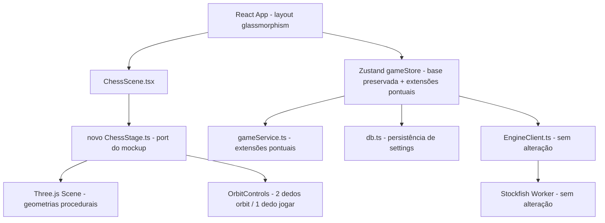
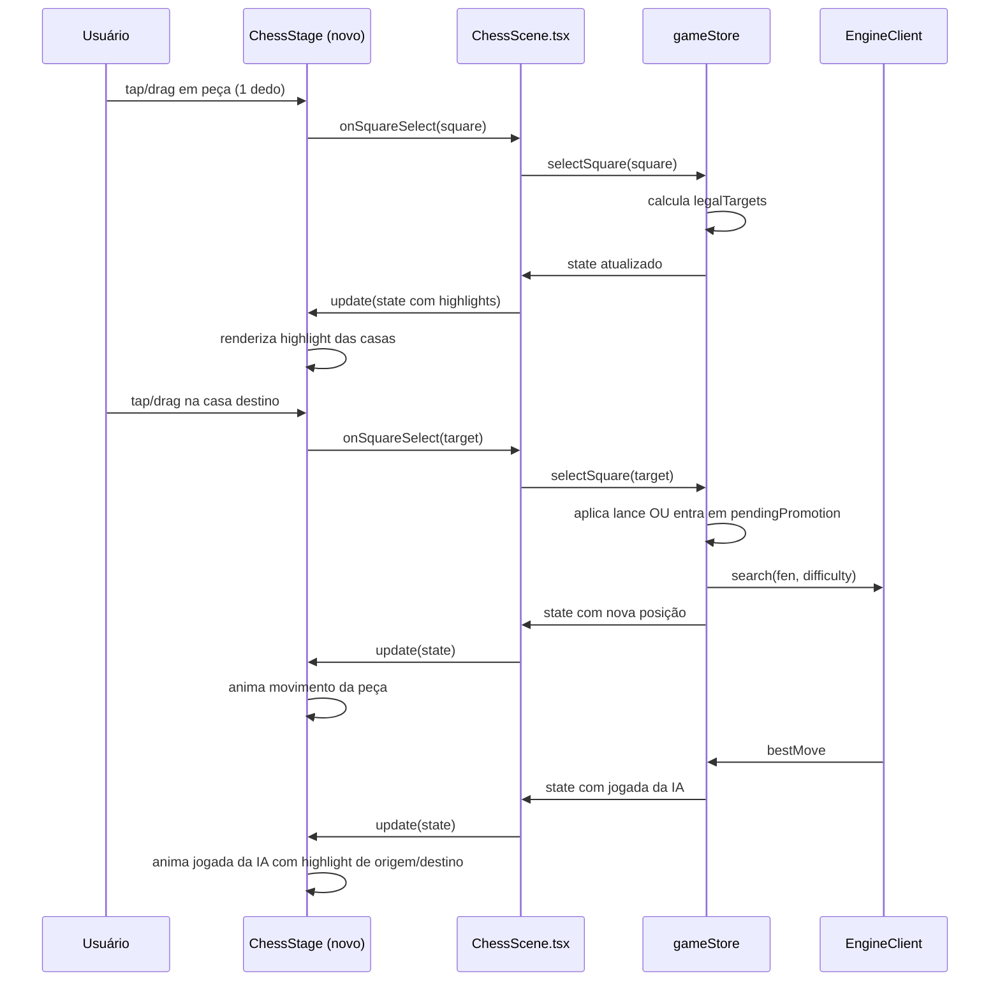

# Tech Plan — Pipo Chess 3d

Referências: spec:6c8fb743-ea96-401f-aa24-914f32fadeda/6e4679c4-e7d8-4cbe-9dd5-3fb83bfef724 · spec:6c8fb743-ea96-401f-aa24-914f32fadeda/2c83433e-787d-44fb-947d-0fcb1d075901

---

## 1. Abordagem Arquitetural

### Visão Geral

O projeto já possui uma base de código real e funcional: engine Stockfish.wasm integrada via Web Worker com protocolo UCI, lógica de jogo completa (chess.js), persistência em IndexedDB (Dexie), gerenciamento de estado (Zustand) e uma UI React operacional. O trabalho do MVP é **evoluir** essa base — não reescrever.

As duas mudanças estruturais principais são:

1. **Substituição do canvas 3D:** O file:src/scene/ChessStage.ts atual usa materiais simples e câmera fixa carregando peças via GLTF. Ele será substituído por um novo módulo de cena que porta o visual premium do file:src/assets/mockup tabuleiro 3d.html (materiais `MeshPhysical`, madeira procedural, iluminação dramática, geometrias por código) diretamente para TypeScript, mantendo a mesma interface pública (`update()`, `dispose()`, `init()`).
2. **Reformulação completa da UI:** O layout atual (file:src/App.tsx) é desktop-first com painéis accordion laterais. Será substituído por um layout mobile-first com canvas full-screen e barras retráteis glassmorphism (topo, base e lateral).

### Decisões Arquiteturais


| Decisão                        | Escolha                                           | Rationale                                                                      |
| ------------------------------ | ------------------------------------------------- | ------------------------------------------------------------------------------ |
| **Peças 3D**                   | Geometrias procedurais (port do mockup)           | Visual premium já validado, zero dependência de arquivo externo, tamanho menor |
| **Tabuleiro**                  | Geometrias procedurais (port do mockup)           | Madeira procedural, `MeshPhysical`, bordas duplas e acento dourado já prontos  |
| **GLTF**                       | Removido do caminho crítico no MVP                | Sem fallback no MVP; pode retornar em v1.1 como "tema alternativo"             |
| **Câmera**                     | OrbitControls estático (sem auto-rotate)          | Câmera sempre controlada pelo usuário                                          |
| **Conflito orbit vs. seleção** | 2 dedos = orbit, 1 dedo = jogar                   | Separação limpa de intenção, sem ambiguidade                                   |
| **Layout UI**                  | Mobile-first glassmorphism, canvas full-screen    | Conforme Core Flows; canvas como protagonista                                  |
| **Engine**                     | Stockfish 18 Lite (`stockfish-18-lite-single.js`) | Já embutido em file:public/assets/stockfish/                                   |
| **Persistência**               | IndexedDB via Dexie                               | Já implementado e funcional                                                    |
| **Estado global**              | Zustand                                           | Já implementado e funcional                                                    |


### Princípio de integração

Os módulos de engine (`file:src/engine/EngineClient.ts` e `file:src/engine/engineAdapter.worker.ts`) permanecem intocados. `file:src/state/gameStore.ts`, `file:src/game/gameService.ts` e `file:src/persistence/db.ts` continuam sendo a base existente, mas recebem **extensões pontuais e localizadas** para viabilizar requisitos já definidos nos Core Flows: persistir `animationMode` e `defaultViewMode`, iniciar partidas com cor configurável/aleatória, abrir um fluxo de promoção pendente via popup e sustentar navegação no modo análise. A interface entre o canvas e o resto do sistema continua majoritariamente preservada: `ChessScene.tsx` segue recebendo `session`, `selectedSquare`, `legalTargets`, `hintMove` e emitindo `onSquareSelect`, enquanto o contrato App ↔ store cresce com estado/ações transitórios específicos desses fluxos.



### Restrições

- O file:src/engine/engineAdapter.worker.ts e file:src/engine/EngineClient.ts não são alterados.
- Os tipos em file:src/types/game.ts são preservados como base; novos campos (ex: `animationMode`, `defaultViewMode`) e tipos transitórios de UI/estado são adicionados como extensões.
- `file:src/state/gameStore.ts`, `file:src/game/gameService.ts` e `file:src/persistence/db.ts` só podem receber mudanças estritamente necessárias para cor configurável da partida, promoção pendente, navegação de análise e persistência das novas preferências.
- A `ThemeDefinition` em file:src/types/game.ts ganha campos adicionais para cores do canvas 3D (cores do acento, do feltro, da névoa).

---

## 2. Modelo de Dados

### Extensões ao modelo existente

Nenhuma tabela nova é necessária. As mudanças são extensões dos tipos e dados existentes.

#### `ThemeDefinition` — novos campos para o canvas 3D

```ts
// Adição a src/types/game.ts
canvasAccent: string       // cor do anel dourado da borda (#d4af37 no mockup)
canvasFelt: string         // cor do feltro embaixo das peças (#081c0c)
canvasFog: string          // cor da névoa da cena (#050508)
```

Os temas existentes em file:src/data/themes.ts recebem esses valores como extensão.

#### `AppSettings` — novos campos de preferência

```ts
// Adição a src/types/game.ts
animationMode: 'normal' | 'reduced' | 'off'
defaultViewMode: '3d' | '2d'
```

Persistem via `persistSettings()` já existente em file:src/persistence/db.ts.

#### `GameSession` — sessão configurável por partida

O campo `playerColor` permanece em `GameSession`, mas deixa de ser tratado como constante fixa da aplicação. Ele passa a ser definido a cada nova partida a partir da escolha **Brancas / Pretas / Aleatório** do jogador no `NewGameSheet`.

O `viewMode` em runtime (3D vs top-down/2D) continua sendo estado local do canvas, mas passa a ser inicializado a partir de `settings.defaultViewMode` ao abrir ou restaurar uma partida.

### Estado transitório no store (não persistido)

O app/store mantém estado transitório adicional para fluxos que exigem coordenação entre canvas e UI:

| Estado               | Tipo                        | Descrição                                                                  |
| -------------------- | --------------------------- | -------------------------------------------------------------------------- |
| `pendingPromotion`   | objeto \/ `null`           | Jogada de promoção aguardando a escolha do jogador no `PromotionPopup`     |
| `analysisCursor`     | `number \| null`           | Ply atualmente exibido no modo análise                                     |
| `analysisAutoplay`   | `boolean`                   | Se o modo análise está em reprodução automática                            |

### Estado local do canvas (não persistido)

O novo `ChessStage` mantém internamente:


| Estado          | Tipo               | Descrição                              |
| --------------- | ------------------ | -------------------------------------- |
| `viewMode`      | `'3d' | 'topdown'` | Preset de câmera atual                 |
| `isDragging`    | `boolean`          | Flag de drag ativo na peça             |
| `dragPiece`     | `Object3D | null`  | Peça sendo arrastada                   |
| `introProgress` | `number`           | Progresso da animação de entrada (0→1) |


---

## 3. Arquitetura de Componentes

### Novo `ChessStage.ts` — substituição total

O file:src/scene/ChessStage.ts atual é substituído por uma nova implementação que porta o visual do mockup e adiciona as capacidades de gameplay.

**Responsabilidades do novo ChessStage:**


| Responsabilidade                                                            | Origem                                |
| --------------------------------------------------------------------------- | ------------------------------------- |
| Cena Three.js, renderer, câmera                                             | Port do mockup                        |
| Tabuleiro com madeira procedural + bordas + acento dourado                  | Port do mockup                        |
| Peças com geometrias procedurais (`LatheGeometry`, `ExtrudeGeometry`, etc.) | Port do mockup                        |
| Iluminação dramática (`HemisphereLight` + `SpotLight` + `DirectionalLight`) | Port do mockup                        |
| `PMREMGenerator` + `RoomEnvironment` para reflexos nos materiais            | Port do mockup                        |
| `OrbitControls` com `enableDamping` — sem auto-rotate                       | Port do mockup (modificado)           |
| Separação 1 dedo (jogar) / 2 dedos (orbit) em mobile                        | Novo                                  |
| Raycasting para seleção via tap e drag                                      | Port do `ChessStage` atual (adaptado) |
| Drag-and-drop de peças                                                      | Novo                                  |
| Highlights de casas (seleção, alvos válidos, dica)                          | Port do `ChessStage` atual            |
| Animações fluidas de movimento (tweening interno)                           | Novo                                  |
| Animação de captura (peça removida com fade/escala)                         | Novo                                  |
| Animação de desfazer/refazer (movimento reverso)                            | Novo                                  |
| Preset de câmera top-down + crossfade 3D ↔ sprites 2D                       | Novo                                  |
| Sprites 2D no modo top-down                                                 | Novo                                  |
| Controle de intensidade de animação (`normal`/`reduced`/`off`)              | Novo                                  |
| Sem rotação automática de câmera                                            | Decisão explícita                     |


**Interface pública (compatível com `ChessScene.tsx` existente):**

```ts
class ChessStage {
  constructor(container: HTMLDivElement, onSquareSelect: (square: Square) => void)
  async init(): Promise<void>
  update(state: RenderState): void   // mesmo contrato de hoje
  setPaused(paused: boolean): void
  dispose(): void
  // Novo:
  setCameraPreset(preset: 'classic' | 'side' | 'topdown' | '2d'): void
  setAnimationMode(mode: 'normal' | 'reduced' | 'off'): void
}
```

### Reformulação de `App.tsx` e layout

O file:src/App.tsx é reformulado para o layout mobile-first glassmorphism. A maior parte da lógica existente e das chamadas ao `useGameStore` é preservada, mas o contrato do store é ampliado pontualmente para suportar configuração da nova partida (cor escolhida/aleatória), promoção pendente, preferência de visualização padrão e navegação do modo análise.

**Nova estrutura de layout:**

```
<div class="app-shell">                        ← canvas full-screen
  <Canvas3D />                                 ← ChessScene (100vw × 100vh)

  <TopBar />                                   ← barra retrátil topo (glassmorphism)
  │  [recolhida] pílulas de relógio
  │  [expandida] nomes + relógios + nível IA

  <BottomBar />                                ← barra retrátil base (glassmorphism)
  │  [recolhida] ícones-pílula
  │  [expandida] Nova Partida · Desfazer · Refazer · Dica · Câmera · Menu

  <HistoryPanel />                             ← painel lateral direito (deslizante)
  │  lista de jogadas em notação algébrica

  <MenuDrawer />                               ← drawer central (glassmorphism)
  │  Configurações · Partidas Salvas · Análise · PGN · Animações

  <NewGameSheet />                             ← bottom sheet (glassmorphism)
  │  Cor · Nível IA · Tempo

  <PromotionPopup />                           ← popup acima do peão

  <ResultModal />                              ← modal fim de partida

  <CameraPresetPicker />                       ← seletor de preset de câmera
</div>
```

### Novos componentes


| Componente           | Responsabilidade                                                             |
| -------------------- | ---------------------------------------------------------------------------- |
| `TopBar`             | Exibe relógio ativo/inativo de ambos os lados + estado da IA, retrátil       |
| `BottomBar`          | Ações principais retráteis com glassmorphism                                 |
| `HistoryPanel`       | Painel lateral de histórico de jogadas (desliza da borda direita)            |
| `MenuDrawer`         | Drawer central com configurações, análise, partidas salvas, temas, animações |
| `NewGameSheet`       | Bottom sheet de configuração de nova partida (cor, nível, tempo)             |
| `PromotionPopup`     | Popup compacto de seleção de peça na promoção                                |
| `ResultModal`        | Modal glassmorphism de fim de partida                                        |
| `CameraPresetPicker` | Seletor de presets de câmera (acessado via botão na BottomBar)               |
| `EvalBar`            | Barra de avaliação no modo análise (lateral esquerda do canvas)              |


### Componentes preservados (sem alteração)


| Componente/módulo                   | Status                                                       |
| ----------------------------------- | ------------------------------------------------------------ |
| `ChessScene.tsx`                    | Preservado (interface inalterada com `ChessStage`)           |
| `AnalysisSummaryView.tsx`           | Preservado, realocado dentro do `MenuDrawer`                 |
| `MoveList.tsx`                      | Preservado, realocado dentro do `HistoryPanel`               |
| `gameStore.ts`                      | Base preservada, com extensões pontuais para configuração de partida, promoção pendente, cursor de análise e preferências |
| `gameService.ts`                    | Base preservada, com extensões pontuais para `playerColor` configurável e promoção escolhida                              |
| `EngineClient.ts`                   | Preservado integralmente                                                                                                    |
| `engineAdapter.worker.ts`           | Preservado integralmente                                                                                                    |
| `db.ts`                             | Preservado, com extensão para persistir novas preferências de settings                                                     |
| `analysis.ts`                       | Preservado integralmente                                                                                                      |
| `pgn.ts`                            | Preservado com ajuste forward-compatible mínimo para manter novos campos de settings ao importar PGN                         |
| `board.ts`, `format.ts`, `files.ts` | Preservados integralmente                                    |
| `difficulties.ts`, `clocks.ts`      | Preservados integralmente                                    |
| `i18n/`                             | Preservado; novas strings adicionadas para novos componentes |


### Fluxo de dados — jogada do usuário



Se o destino exigir promoção, `selectSquare(target)` não aplica o lance imediatamente: o store entra em `pendingPromotion`, a `PromotionPopup` coleta a peça desejada e só então o lance final é confirmado.

No modo análise, o App deriva o FEN exibido a partir de `analysisCursor` e continua entregando ao `ChessScene` um estado compatível com o contrato atual.

### Estratégia de animação

O `ChessStage` implementa um sistema interno de tweening leve (sem biblioteca externa) baseado no loop `requestAnimationFrame` já existente:

- **Normal:** movimento de peça com curva de Bézier suave (arco no espaço 3D), duração ~300ms
- **Reduced:** deslocamento linear direto, duração ~150ms; sem animações de captura elaboradas
- **Desligado:** posição aplicada diretamente sem interpolação; highlights visuais de jogada da IA mantidos

O `animationMode` é lido do estado Zustand e passado ao `ChessStage` via `setAnimationMode()`.
