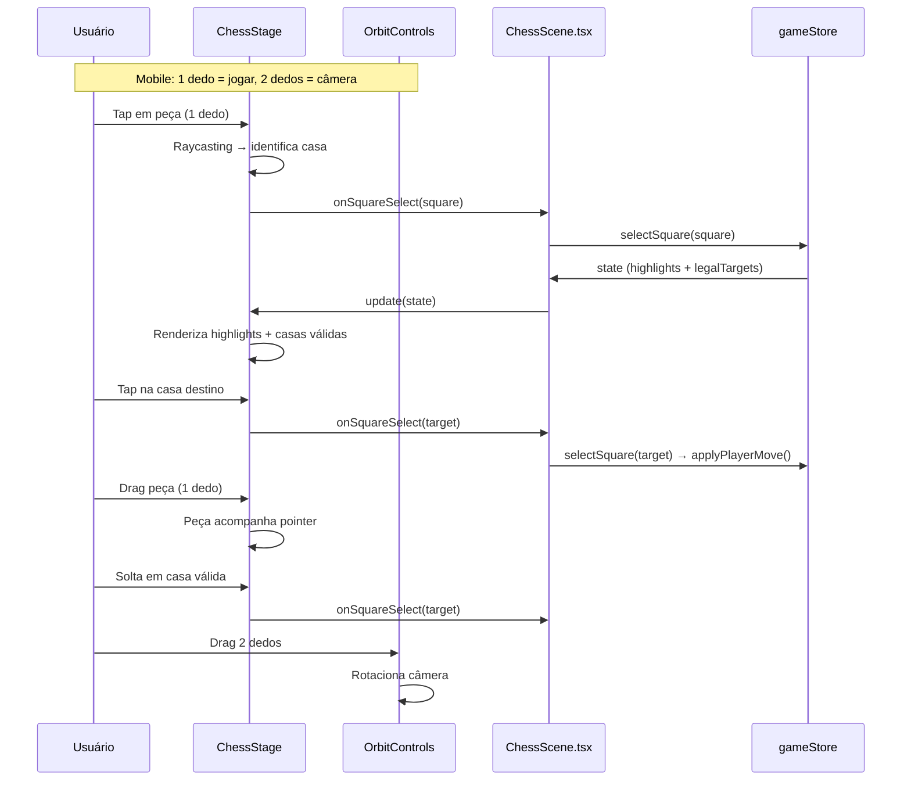

# Interatividade do ChessStage — Raycasting, tap-tap, drag-and-drop e highlights

## Contexto

Refs: `spec:6c8fb743-ea96-401f-aa24-914f32fadeda/c9191e9e-098e-42c6-8dbd-f4284d2d6260` (seção 3 — Arquitetura de Componentes, Fluxo de dados — jogada do usuário) · `spec:6c8fb743-ea96-401f-aa24-914f32fadeda/2c83433e-787d-44fb-947d-0fcb1d075901` (Fluxo 2 — Gameplay, Fluxo 3 — Solicitar Dica, Fluxo 5 — Controle de Câmera / separação de gestos)

O `ticket:6c8fb743-ea96-401f-aa24-914f32fadeda/eede9e28-314c-4477-ab2f-e029939b011e` entrega o canvas visual premium com OrbitControls básico, mas sem interação de jogo. Este ticket adiciona toda a interatividade de gameplay ao `ChessStage`: raycasting para detecção de casas, seleção por tap-tap, drag-and-drop de peças e highlights visuais — tudo com separação limpa entre gestos de câmera e gestos de jogo.

## Escopo

### Incluído — Separação de gestos (mobile vs. desktop)

1. **Mobile — 1 dedo = jogar:** Toque simples detecta a casa via raycasting. Arraste com 1 dedo em cima de uma peça própria inicia drag-and-drop.
2. **Mobile — 2 dedos = câmera:** Configurar `OrbitControls` para aceitar apenas `touches.ONE = null` (ou equivalente) de modo que rotação e zoom exijam 2+ dedos. Assim 1 dedo fica 100% reservado para o jogo.
3. **Desktop — click sem drag = selecionar:** Diferenciar click simples (pointerdown + pointerup na mesma posição, sem movimento significativo) de click+drag (orbit). Click simples dispara raycasting e seleção.
4. **Desktop — click+drag = orbit:** Comportamento padrão do OrbitControls para mouse.
5. **Desktop — scroll = zoom:** Comportamento padrão.

### Incluído — Raycasting e seleção (tap-tap)

6. **Hit detection:** raycasting contra o `hitPlane` (plano invisível sobre o tabuleiro) para converter coordenadas de tela em casas do tabuleiro (`Square`). Adaptado do sistema existente em `file:src/scene/ChessStage.ts`.
7. **Tap-tap:** ao tocar em uma peça própria, ela é selecionada. Ao tocar em uma casa válida, `onSquareSelect` é chamado com a casa destino. O `gameStore` cuida da lógica de validação — o canvas apenas reporta a casa tocada.

### Incluído — Drag-and-drop

8. **Início do drag:** quando o jogador toca em uma peça própria e arrasta (sem soltar), a peça acompanha o pointer/toque no espaço 3D (projeção raycasting contínua durante o arraste).
9. **Durante o drag:** a peça se eleva levemente e segue o cursor/dedo. As casas válidas continuam indicadas.
10. **Soltar em destino válido:** reporta `onSquareSelect(target)` e a peça é posicionada na casa destino.
11. **Soltar em destino inválido:** a peça retorna suavemente à casa de origem.
12. **Flag `isDragging`:** estado interno do canvas para gerenciar o ciclo de drag.

### Incluído — Highlights visuais

13. **Seleção:** a peça selecionada recebe glow/emissive highlight. A casa sob ela fica destacada.
14. **Casas válidas:** casas livres recebem círculos semi-transparentes; casas com peça inimiga recebem anéis indicadores.
15. **Dica:** as casas de origem e destino da dica pulsam com cor diferenciada (animação simples de opacidade no loop de render), conforme `Fluxo 3 — Solicitar Dica`.
16. **Highlight de última jogada da IA:** as casas de origem e destino da jogada mais recente ficam brevemente destacadas.

### Explicitamente fora

- Animações de movimento de peças (trajetória, captura, roque etc.) — `ticket:6c8fb743-ea96-401f-aa24-914f32fadeda/94baece0-1f78-4ea1-bb0c-3fa1487a3a45`.
- Presets de câmera e modo 2D — `ticket:6c8fb743-ea96-401f-aa24-914f32fadeda/f36ce088-b064-4494-8283-b7203fda16ca`.
- Mudanças em `ChessScene.tsx` além do necessário para interatividade.
- Mudanças em módulos de negócio (`gameStore`, `gameService`, `EngineClient`, `db`).

## Dependências

- **Depende de:** `ticket:6c8fb743-ea96-401f-aa24-914f32fadeda/eede9e28-314c-4477-ab2f-e029939b011e` (Port visual do mockup — a cena precisa existir para receber interatividade).

## Fluxo de dados

## Critérios de aceite

- [ ] Em mobile: 1 dedo fica 100% reservado para jogar; OrbitControls não responde a 1 dedo.
- [ ] Em mobile: 2 dedos rotacionam/zoomam a câmera normalmente.
- [ ] Em desktop: click simples (sem movimento) seleciona peça/casa; click+drag orbita a câmera.
- [ ] Tap-tap funciona: tocar em peça própria → highlights de casas válidas → tocar em destino → `onSquareSelect` chamado.
- [ ] Drag-and-drop funciona: arrastar peça com 1 dedo → peça acompanha pointer → soltar em destino válido dispara `onSquareSelect`.
- [ ] Drag-and-drop para destino inválido: peça retorna suavemente à origem.
- [ ] Highlights de seleção (glow na peça, casa destacada) renderizam corretamente.
- [ ] Casas válidas mostram indicadores visuais (círculos para livres, anéis para capturas).
- [ ] Dica mostra highlight pulsante com cor diferenciada nas casas de origem e destino.
- [ ] Sem conflito entre gestos de câmera e gestos de jogo em nenhuma plataforma.
- [ ] `ChessScene.tsx` continua funcionando sem alteração de interface.
- [ ] Testes existentes passam sem alteração.